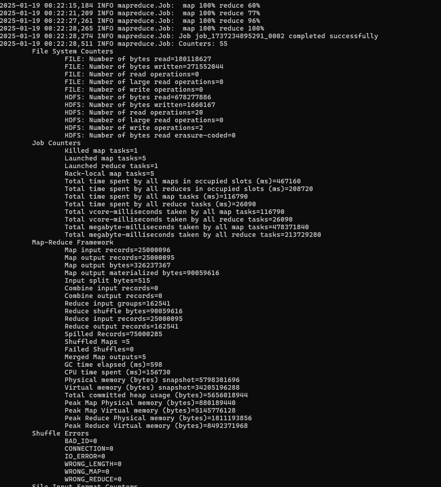
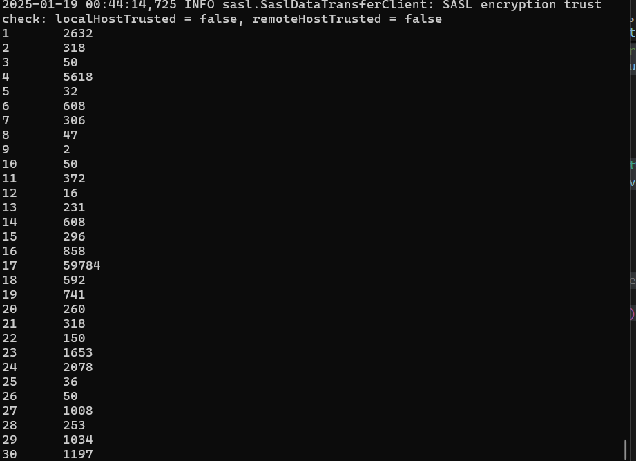
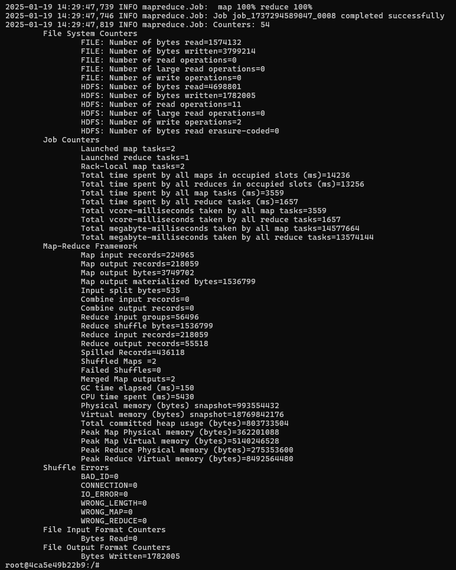
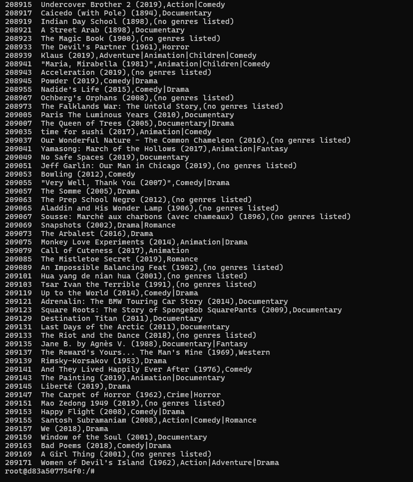
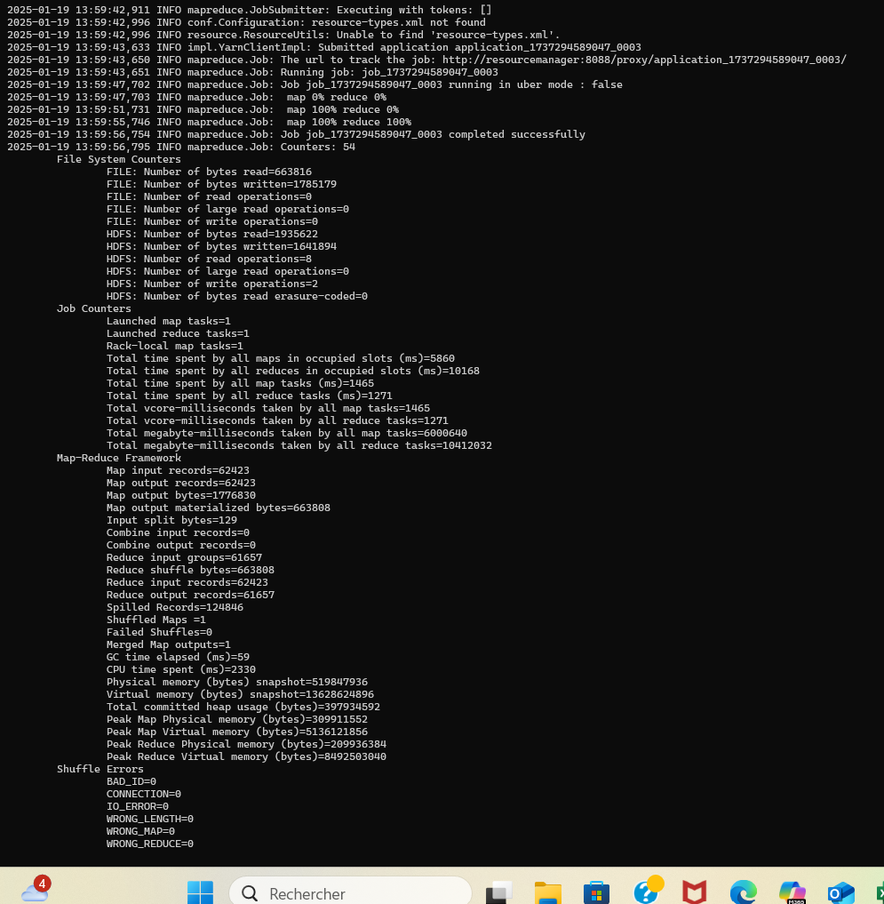
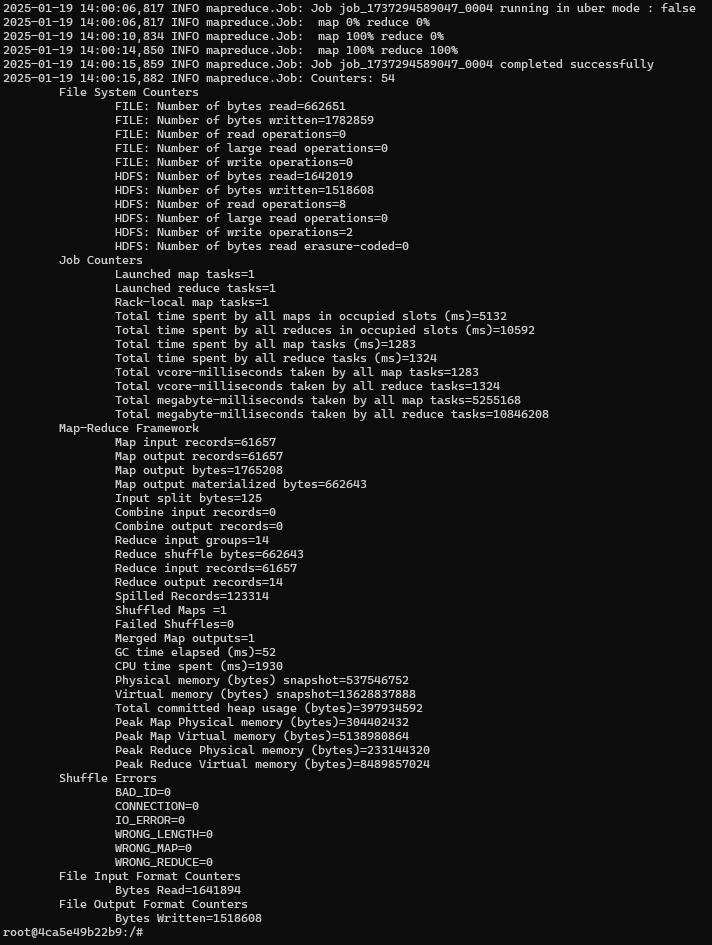
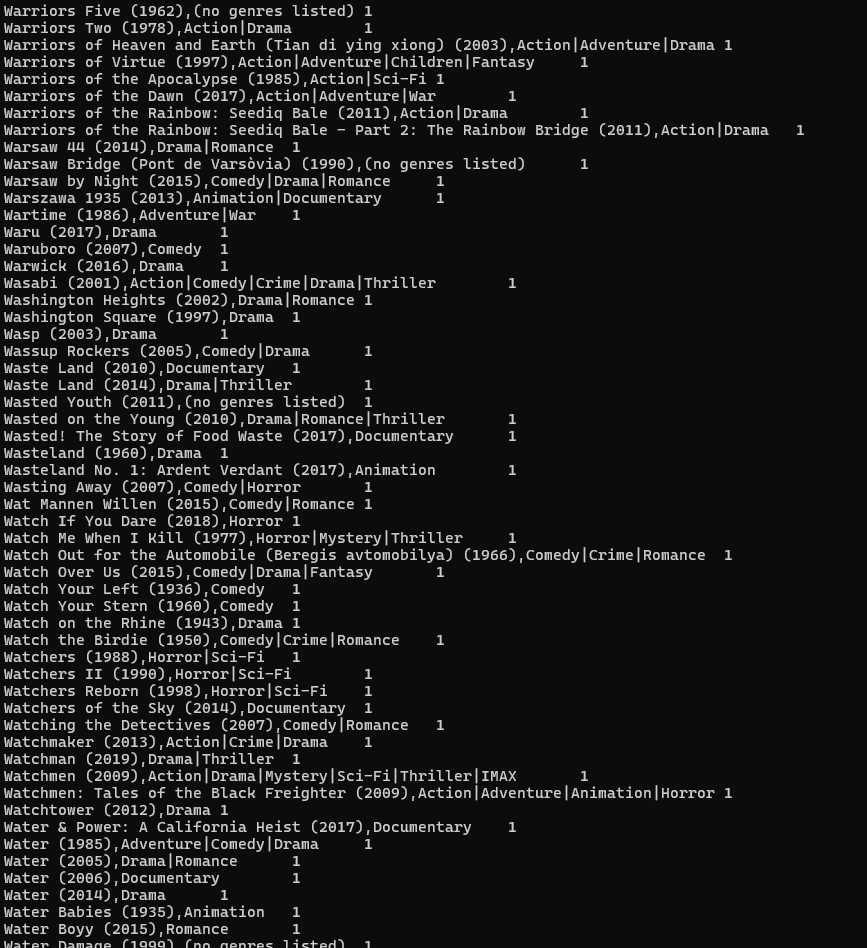

# LSDS

## Preparation

build docker compose file
```bash
docker compose up --build -d
```

Compile program jar
```bash
maven clean package
```
Le jar compilé doit être placé dans le dossier /ressources pour être partagé avec ressourcemanager.

Placer les fichiers csv dans /input :

```bash
hdfs dfs -put /hadoop/moviesProject/movieDatas/ /input

```
Si besoin lister les fichiers contenu dans /input ou les supprimer :
```bash
hdfs dfs -ls /input

hdfs dfs -rm /input
```

Dans un terminal, se placer dans le contenaire resourcemanager :
```bash
docker exec -it resourcemanager bash
ls /hadoop/moviesProject/
```
Dévloppé dans la section Project (lancer un jar pour un script) : 
```bash
hadoop jar hadoop/moviesProject/haddopproject-1.0-SNAPSHOT.jar <class_name> <input_path> <output_path>
```

Lister le contenu de /output
```bash
hdfs dfs -ls /output
```


## Project

### The highest rated movieID per user

Le programme `HighestRatedMoviePerUser` est conçu pour déterminer quel est le film le mieux noté par chaque utilisateur à partir des données d'évaluation (ratings). Il utilise Hadoop MapReduce pour traiter les données et obtenir un résultat sous forme de liste des films ayant les meilleures évaluations par utilisateur.


##### Tester le jar
```bash
hadoop jar /hadoop/moviesProject/haddopproject-1.0-SNAPSHOT.jar highestRated /input/ratings.csv /output/highestMovieRatedPerUser
hdfs dfs -cat /output/highestMovieRatedPerUser/part-r-00000


hdfs dfs -rm -r /output/highestMovieRatedPerUser

```
**EXECUTION :**




**RESULT : userID favoriteMovieId**




### Find the name of the highest rated movie per userID

Le programme `JoinHighestRatedMovie` utilise Hadoop MapReduce pour effectuer une jointure entre les résultats de la question 1, qui contiennent les films les mieux notés par chaque utilisateur, et les informations détaillées sur les films (comme le nom du film). L'objectif est de lier chaque `userId` aux films qu'il a évalués, en affichant le nom de ces films.


##### Tester le jar

```bash
hadoop jar /hadoop/moviesProject/haddopproject-1.0-SNAPSHOT.jar joinOperation /output/highestMovieRatedPerUser /input/movies.csv /output/highestMovieNamePerUser

hdfs dfs -cat /output/highestMovieNamePerUser/part-r-00000

hdfs dfs -rm -r /output/highestMovieNamePerUser

```

**EXECUTION :**




**RESULT : userID favoriteMovieName**



### Count likes per film + group by like count
Pemet de regrouper les films par nombre de like 

##### Tester le jar

```bash

hadoop jar /hadoop/moviesProject/haddopproject-1.0-SNAPSHOT.jar likeCount /output/highestMovieNamePerUser /output/groupResults

hdfs dfs -cat /output/groupResults/part-r-00000

hdfs dfs -rm -r /user/root/intermediate_output
hdfs dfs -rm -r /output/groupResults
```

**EXECUTION :**

First job 



Second job




**RESULT : Group by number of likes**


**intermediate result**




