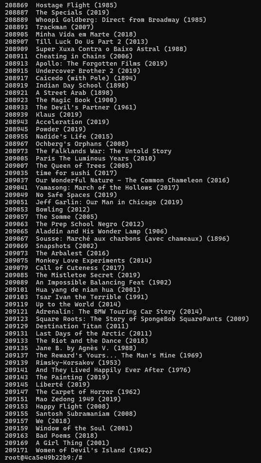
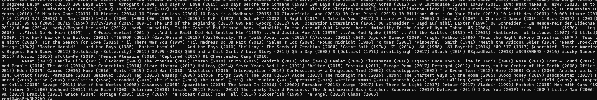
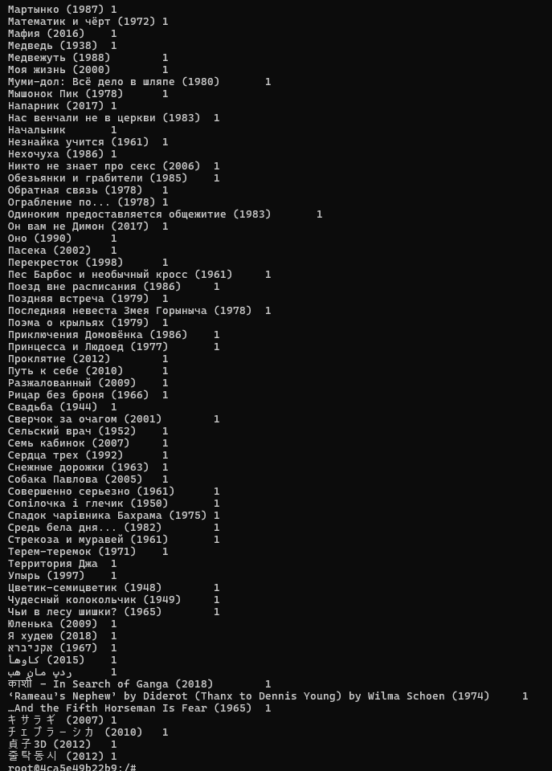

# LSDS

## Preparation

build docker compose file
```bash
docker compose up --build -d
```

Compile program jar
```bash
maven clean package
```
Le jar compilé doit être placé dans le dossier /ressources pour être partagé avec ressourcemanager.

Placer les fichiers csv dans /input :

```bash
hdfs dfs -put /hadoop/moviesProject/movieDatas/ /input

```
Si besoin lister les fichiers contenu dans /input ou les supprimer :
```bash
hdfs dfs -ls /input

hdfs dfs -rm /input
```

Dans un terminal, se placer dans le contenaire resourcemanager :
```bash
docker exec -it resourcemanager bash
ls /hadoop/moviesProject/
```
Dévloppé dans la section Project (lancer un jar pour un script) : 
```bash
hadoop jar hadoop/moviesProject/haddopproject-1.0-SNAPSHOT.jar <class_name> <input_path> <output_path>
```

Lister le contenu de /output
```bash
hdfs dfs -ls /output
```


## Project

### The highest rated movieID per user

Le programme `HighestRatedMoviePerUser` est conçu pour déterminer quel est le film le mieux noté par chaque utilisateur à partir des données d'évaluation (ratings). Il utilise Hadoop MapReduce pour traiter les données et obtenir un résultat sous forme de liste des films ayant les meilleures évaluations par utilisateur.

#### Fonctionnalité principale :
- Le programme prend deux arguments en entrée : 
  - Le fichier d'entrée `ratings.csv` contenant les évaluations des utilisateurs.
  - Le répertoire de sortie `highestMovieRatedPerUser` où les résultats seront stockés.

#### Fonctionnalité du Mapper :
- Il parcourt chaque ligne du fichier et extrait le `userId` (l'identifiant de l'utilisateur) et les informations de film (`movieId`, `rating`).
- Si la ligne est incorrecte ou corrompue (par exemple, un format invalide), elle est ignorée et un avertissement est loggé.
- Les paires clé-valeur sont envoyées au Reducer :
  - **Clé** : `userId` (identifiant de l'utilisateur).
  - **Valeur** : Une chaîne contenant `movieId` et `rating` séparés par une virgule.

#### Fonctionnalité du Reducer :
- Le Reducer reçoit toutes les évaluations des films pour un utilisateur sous forme d'une liste (chaîne de caractères contenant `movieId,rating`).
- Il compare les évaluations et garde celle avec la meilleure note.
- Le résultat final est une paire clé-valeur avec :
  - **Clé** : `userId` (identifiant de l'utilisateur).
  - **Valeur** : `movieId` du film avec la meilleure note.


##### Tester le jar
```bash
hadoop jar /hadoop/moviesProject/haddopproject-1.0-SNAPSHOT.jar highestRated /input/ratings.csv /output/highestMovieRatedPerUser
hdfs dfs -cat /output/highestMovieRatedPerUser/part-r-00000


hdfs dfs -rm -r /output/highestMovieRatedPerUser

```
**EXECUTION :**


**RESULT : userID favoriteMovieId**


### Find the name of the highest rated movie per userID

Le programme `JoinHighestRatedMovie` utilise Hadoop MapReduce pour effectuer une jointure entre les résultats de la question 1, qui contiennent les films les mieux notés par chaque utilisateur, et les informations détaillées sur les films (comme le nom du film). L'objectif est de lier chaque `userId` aux films qu'il a évalués, en affichant le nom de ces films.

#### Fonctionnalité principale :
- Le programme prend trois arguments en entrée :
  - Le fichier contenant les résultats de la question précédante 
  - Le fichier contenant les informations des films (`movies.csv`).
  - Le répertoire de sortie pour stocker les résultats.

- Le job Hadoop est créé avec deux Mappers (`MoviesMapper` et `RatingsMapper`) et un Reducer (`JoinReducer`).
- L'opération de jointure est effectuée par le `Reducer`, qui associe le nom du films avec les id des films.

#### Fonctionnalité du mapper:
- Le Mapper lit le fichier des films et sépare les champs avec une virgule.
- Si l'entrée est valide (non entête), il extrait `movieId` et le nom du film.
- La sortie est une paire clé-valeur où la **clé** est `movieId` et la **valeur** est le nom du film, préfixée par `"M:"`.

#### Fonctionnalité du RatingsMapper:
- Le Mapper lit les évaluations des utilisateurs et les sépare en fonction des tab.
- Il extrait `userId` et `movieId`.
- La sortie est une paire clé-valeur où la **clé** est `movieId` et la **valeur** est l'ID de l'utilisateur, préfixée par `"U:"`.


#### Fonctionnalité du Reducer (réalise la jointure) :
- Le Reducer reçoit toutes les paires avec la même clé `movieId` et parcourt les valeurs associées à cette clé.
- Pour chaque valeur venant de `MoviesMapper` (préfixée par `"M:"`), le nom du film est extrait.
- Pour chaque valeur venant de `RatingsMapper` (préfixée par `"U:"`), l'ID de l'utilisateur est extrait.
- Enfin, une sortie est générée sous la forme de :
  - **Clé** : `movieId`.
  - **Valeur** : Liste des noms de films, séparés par des espaces, pour chaque utilisateur ayant évalué ce film.

##### Tester le jar

```bash
hadoop jar /hadoop/moviesProject/haddopproject-1.0-SNAPSHOT.jar joinOperation /output/highestMovieRatedPerUser /input/movies.csv /output/highestMovieNamePerUser

hdfs dfs -cat /output/highestMovieNamePerUser/part-r-00000

hdfs dfs -rm -r /output/highestMovieNamePerUser

```

**EXECUTION :**


**RESULT : userID favoriteMovieName**



### Count likes per film + group by like count
Le programme `GroupMoviesByLikeCount` est un job Hadoop qui s'exécute en deux étapes pour analyser et grouper les films par nombre de "likes". Voici les différentes étapes :

#### 1. Job 1 : Compter les likes par film
- **Mapper (`UserMovieMapper`)** : 
    - Il lit les données d'entrée (format `userId\tmovieName`) et associe un film (`movieName`) à chaque occurrence.
- **Reducer (`MovieLikeCounterReducer`)** : 
    - Il agrège les valeurs (nombre de fois qu'un film a été aimé) pour chaque film et génère un total de "likes" pour chaque film.

#### 2. Job 2 : Grouper les films par nombre de likes
- **Mapper (`GroupByLikeCountMapper`)** : 
    - Il lit les sorties du job 1 et associe chaque film à son nombre de "likes" pour les regrouper.
- **Reducer (`GroupByLikeCountReducer`)** : 
    - Il regroupe les films en fonction du nombre de "likes"  et génère une liste de films pour chaque nombre de "likes".

#### 3. Résultat
- Le programme génère un fichier de sortie qui contient, pour chaque nombre de "likes", les films correspondants.


##### Tester le jar

```bash

hadoop jar /hadoop/moviesProject/haddopproject-1.0-SNAPSHOT.jar likeCount /output/highestMovieNamePerUser /output/groupResults

hdfs dfs -cat /output/groupResults/part-r-00000

hdfs dfs -rm -r /user/root/intermediate_output
hdfs dfs -rm -r /output/groupResults
```

**EXECUTION :**

Firsth job 


Second job


**RESULT : Group by number of likes**



**intermediate result**




